# Zeepkist Adventure Map

<a href="zeepkist.cactuzhead.com">zeepkist.cactuzhead.com</a>

This website lets you track your progress in Zeepkist’s Adventure Map, including every level thumbnail and medal time.

Click any map pin to cycle through the different completion states, making it easy to mark your progress and quickly see which maps you’ve already completed.

## Release 1.2.0
Release 1.2.0 includes all the Zeepkist v18 features, including:

 - Added L-01 to L-06 to the Adventure Map (as well as total gear count)
 - `L Author Times` video for L-01 to L-06
 - `L Collectables` video for all gears
 - Updated `I Collectables` video to include 10th Strange Gift
 - Added all 49 new collectables to the Cosmetics Index
 - Coded in the new Gears to the website so that they can be tracked like all other collectables

## Release 1.1.0
Release 1.1.0 introduces gift collection tracking, including:

- Red Gifts
- Paint Blobs
- Blue Feathers
- Wheels
- Strange Gifts
- Gear Gifts
- Medal Gifts
- Seasonal Pumpkins
- Seasonal Snowflakes

You’ll also find direct links to YouTube guides to help you collect gifts and complete author runs.

In addition, the new Cosmetics Index page lets you browse, search, and sort every cosmetic item currently in the game - over 3500 items so far. Where applicable, cosmetics also include links to YouTube videos showing how to unlock them.

 
  

      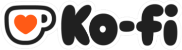
      &nbsp;&nbsp;&nbsp;If you find value in this website and would like to support us, please consider using our <a href="https://ko-fi.com/cactuzhead">ko-fi</a>
  

 

## Not Included in the Cosmetics Index
Competition and custom cosmetics are not included in the index, as these items are generally not available to all players.

## Note
Due to the way Zeepkist renders cosmetics as 3D objects using the same lighting conditions as the level environment, some items can be difficult to distinguish from one another. This is made even more challenging by the fact that certain cosmetics already look very similar in the first place.

As a result, despite my best efforts, there may occasionally be cases where a cosmetic has been incorrectly identified within the index.

The example below demonstrates this issue by comparing how the same cosmetic appears when collected in a level versus how it is displayed in the garage.

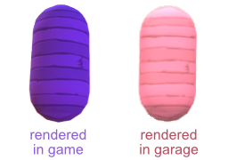

## Completion States
When you start, all the map pins should be set to a red cross icon, denoting an uncompleted level.

If you click on any map pin you can cycle through all the various completion states Uncompleted -> Bronze -> Silver -> Gold -> Author and back to  Uncompleted.

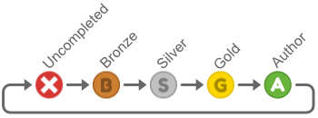

Every time you change the state, the map pin icon will move to the next state, and the popup card will change to reflect the current state (see border section below).

## Popup Card Behavior
Note that the popup card behavior had to be changed for version 1.1.0 due to the inclusion of collectables which need to be interactable on the popup cards.

Now, when you hover over a map pin, the popup card will appear and remain visible even after you move the mouse away, instead of disappearing automatically as it did before.

It will however change if you hover over another map pin.

## Closing the Popup Card
You can either click the `X` button on the top right of the card
--OR--
You can press the `Shift` key.

Holding down the `Shift` key is a simple way to prevent the popup card from appearing, allowing you to move your mouse freely without it getting in the way.

## Border
In the image below , you can see that the border of the popup card has changed to match the current status icon (Gold in this case).

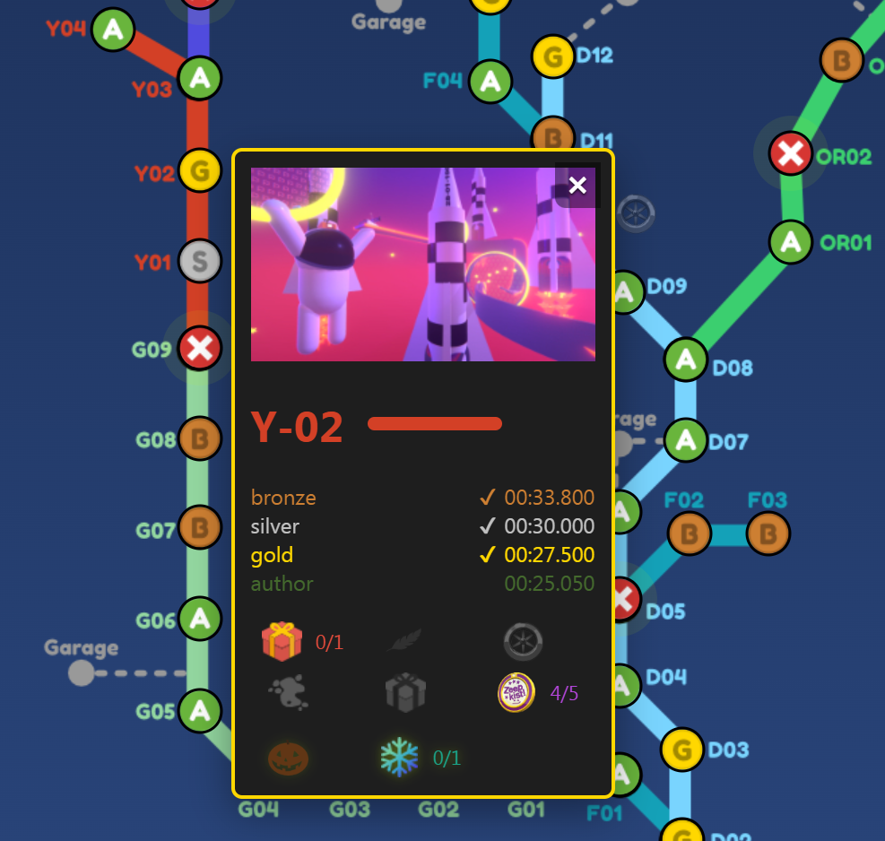

## Medal Times
The completed medals will have a tick mark next to their times and will also be brighter to indicate that you have completed these medals.

You can see in the image above, because the Gold medal has been completed, bronze and silver are also checked and brighter.  Only the green Author medal is dimmer and without a check mark.

## Automatic Medal Gifts
When you cycle though the state of the level from Uncompleted -> Bronze -> Silver -> Gold -> Author and back to Uncompleted the medals counter will automatically adjust itself to show how many cosmetics items you have unlocked.

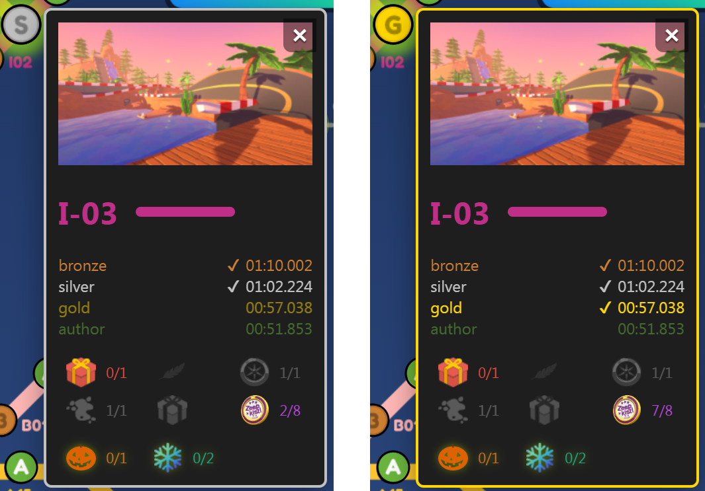

In the example above for level I-03, you can see that the medal counter is set to 2/8 in the first screenshot as you recieve 1 gift for both bronze and silver.

However, in the second screenshot where the player has now completed a gold medal time - the counter is now 7/8.  This is because you unlock 5 cosmetic items if you complete the gold medal time.

And the final medal is of course for beating the Author medal time.

## YouTube Videos
When you hover over the level's thumbnail, you might see one or more YouTube video links appear.

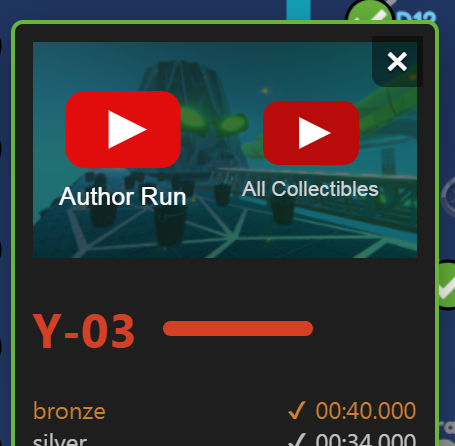
  

Clicking a video will open it in a popup window, where you can watch either an `Author Run` or a guide showing you how to find and collect `All Collectables` in the level.

During October and December, you may also see videos for `All Pumpkins` or `All Snowflakes`, respectively.

To close the popup window, click the `X` button in the top-right corner or simply click anywhere outside the popup.

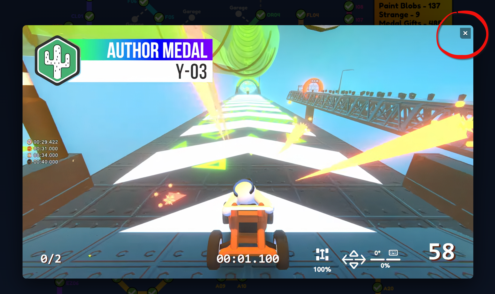

## Level Colors
The level name and the horizontal line beside it (representing the track) always match the color of the track on the main map. For example, all Y (YouTuber) levels are shown in red and all OR (Off-Road) maps are a bright green.

## Colletables
This bottom section of the popup card shows all the collectables, starting with the five permanet ones (red gift, blue feather, wheel, paint blob, strange & gear), then followed by the medals cosmetics for completing medal times (See `Automatic Medal Gifts` section above), and then the two seasonal collectables (pumpkins and snowflakes).

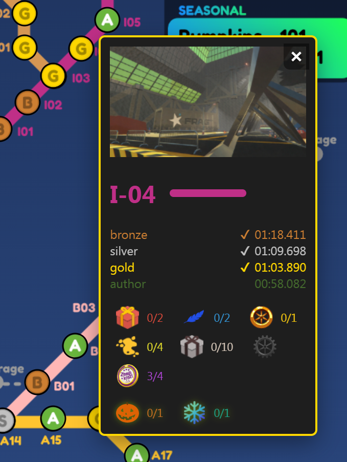

If a level has any collectables, they will be highlighted here and have text values for collected/total to their right.

Any collectables types not found in the level at all are dimmed, and have no text next to them.

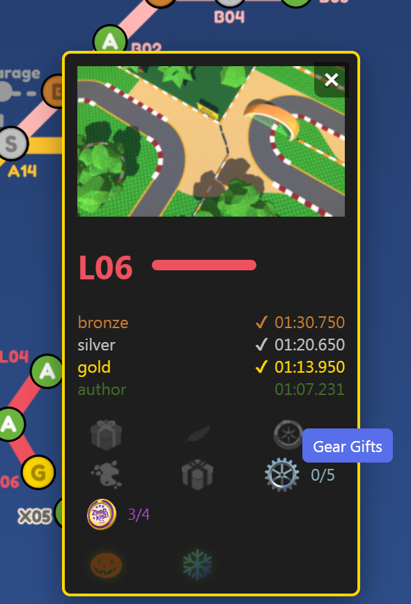

As of Zeepkist v18, we now have an additional collectable type - Gears.

They will be displayed on all level pop-up cards, although at this point in time, all will be dimmed except for L-01 to L-06 as no other map has gear gifts.

In zeepkist you have many different collectables hidden around the adventure levels as well as 3 red gifts, 1 blue feather and 1 wheel in the overworld map itself.

I have seperated all of these into two types: `permanent` and `seasonal`.

#### Permanent Collecatables
- Red Gift
- Blue Feathers
- Wheels
- Paint Blobs
- Strange
- Medal Times
- Gears

#### Seasonal Collectables
- Pumpkins
- Snowflakes

## How to Mark Collectables as Collected
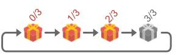

You can click on each highlighted icon to advance their collected value by one.

If a collected value equals the total i.e. 3/3 then both the icon and its text will become dimmed.  If you click it a further time, they will both become highlighted again and the collected value will be reset to zero.

This way, you can easily tell whether you’ve collected all the gifts, as fully completed ones will appear dimmed.

  

# Top Menu Bar
The top menu bar is where stats and controls are available.

## Medal Counters
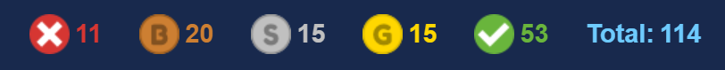

These counters show the totals for uncompleted levels and each medal - bronze, silver, gold and  author and a grand total which should always be 114 as the game stands right now.

In this example, you can see that the player has authored 53 levels, but still has 11 levels where they have not yet achieved at least a bronze rating.

## Collectible Counters
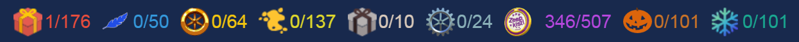

Here you can see each collectable icon with a collectred/total value.
Once all of one type are collected their icon and text will be dimmed so you can easily see any remaining collectables.

After these collectable totals is a total count for all gifts.

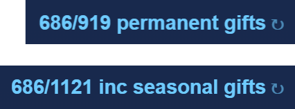

You can toggle betweeen including seasonal gifts or not, by clicking the text.

## Controls
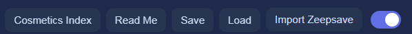

There is a button to go to the new `Cosmetics Index` page (see below for more info), a button to reach this read me file, export & import buttons, and a toggle to change between light and dark mode.

## Cosmetics Index & Adventure Map
Depending on which page you are on you will either see a `Cosmetics Index` or `Adventure Map` button.

These buttons will redirect you to the other web page.

## Read Me
If you are reading this manual then you have most likely already found the `Read Me` button on the top menu bar.

## Data Storage
Your data is stored locally in your browser using localStorage, which means it does not sync across different browsers or devices.

As a result, if you clear your browser data or switch to another device or browser, your saved progress may be unavailable or permanently lost.

### Export / Import
I recommend exporting a backup of your data to a locally saved JSON file using the `Export` button in the top menu bar.

This allows you to `Import` the data back into the same browser - or into a different browser or device if needed.

Please note that any changes made after exporting will not automatically sync between browsers or devices.

You are also free to create and keep multiple export files if you wish  - how you manage them is entirely up to you.

## Light/Dark Theme
Toggling this will switch your page between the dark and light themes. You can set your preference separately for the `Adventure Map` and `Cosmetics Index` pages if you like.

## Window Scaling
While the map automatically scales to fit your window width, please note that the map pins may appear slightly misaligned by a few pixels.

For the best experience, I recommend viewing the map at the largest size possible on your PC - ideally at a width of 1300px or greater.

    

# Cosmetics Index Page
This page allows you to easily browse, search, and sort nearly all the cosmetics that are in the game.

These cosmetics are unlocked via `Adventure Map` collectables, medal times, achievements, DLC and you also get some free ones when you purchase Zeepkist.

I believe the only items that are *not* in the index are any competition or custom cosmetics.

## Top Menu Bar

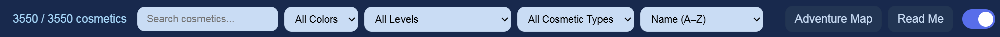

The top menu bar displays the number of currently viewable cosmetics alongside the total available. In the example above, all cosmetics are visible as no filters have been used, so the text is therefore shown as 3550/3550.

You can also use one or more of the dropdown menus to filter your results by `color`, `level`, `cosmetic type`, or use the `text search box` for a broader search based on item criteria.

So for example, you can use the color dropdown and select `Blue` to find all items with some blue in them.  In this example you get a result of 252 `blue` cosmetics.
  

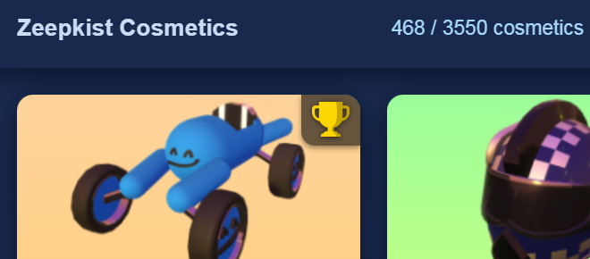
  

You could then filter this large result further by choosing to also only show `hats` from the cosmetic types dropdown.  This reduces the result to 48 `blue hats`.

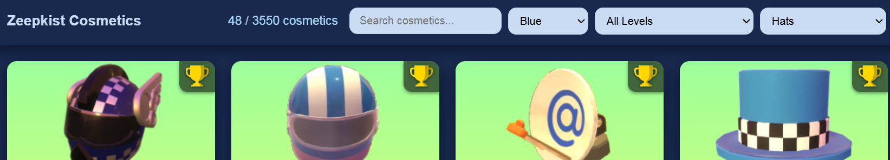
  

Next you could filter it even more by adding a search box filter for `plaid`.
The result would be a list of 5 `blue plaid hats` as shown below.

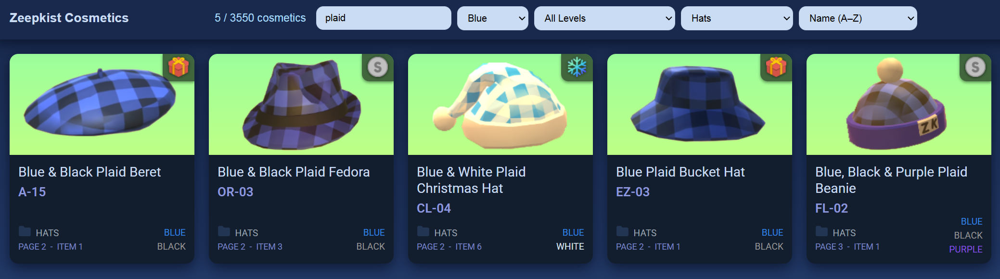

  
By using various combinations you can easily filter your results to find a specific cosmetic.

For example you could search for `green` in the text box as well as using the color dropdown to select `red`, and then also only search for `paragliders`.
In this example your result would show 3 paragliders which feature green and red in them (example below).

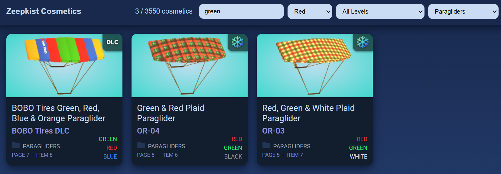

## Read Me
If you are reading this manual then you have most likely already found the `Read Me` button on the top menu bar.

## Cosmetics Index & Adventure Map
Depending on which page you are on you will either see a `Cosmetics Index` or `Adventure Map` button.

These buttons will redirect you to the other web page.

## Light/Dark Theme
Toggling this will switch your page between the dark and light themes. You can set your preference separately for the Adventure Map and Cosmetics pages if you like.

## Sorting
You can additionally sort the results by name, level or location order in the garage, all in ascending or descending order.
This can be used alone or in combination with the other filters.

## Cosmetic Cards
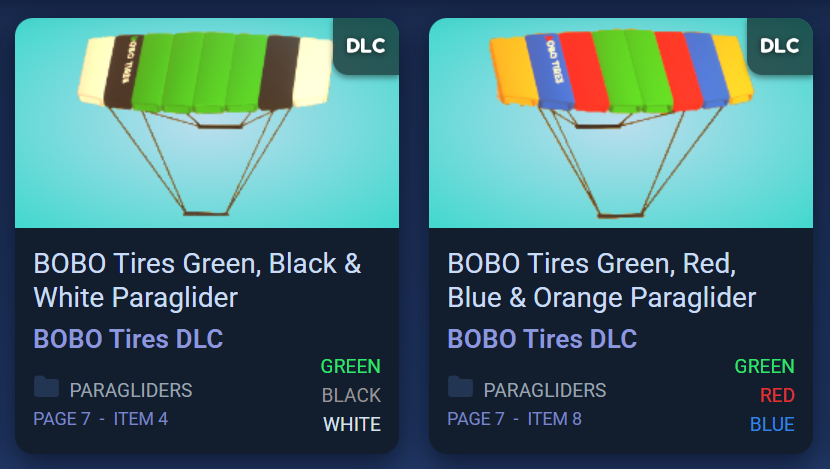

Each cosmetic item will be displayed in a card with a lot of usefull information described in greater detail below.

## Card Thumbnail Section
In this top section you will see a thumbnail of the cosmetic item.

For each type of cosmetic, the background color will be different.
For example, all hats will have a green background, whilst every paraglider has a blue background.

## Unlocked Icon
In the top right of every thumbnail is a small icon denoting how this particular cosmetic is unlocked.

So you may see one of the following icons.

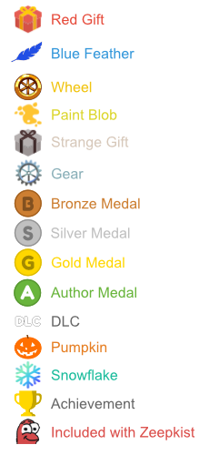

Note that the Yannic smile icon is for included free cosmetic items that are already unlocked for you when you first play the game.

## YouTube Videos
Some cosmetic items will display a YouTube video link when you hover over their thumbnail.

Clicking the link will open a popup window containing a video guide that shows you how to obtain that specific cosmetic item.

This may link directly to the relevant timestamp in the level's `All Collectables` video or, for items unlocked by achieving a specific medal time, to the corresponding `Author Run` video.

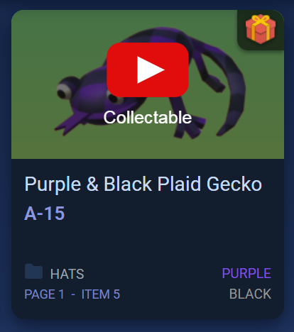

### Collectable Cosmetic
If it is a collectable gift, then you will be shown where it is located and how to obtain it.

### Medal Cosmetic
In the case of a cosmetic that is unlocked by completing a level in a medal time, you will instead be linked to an `Author Run` video.

Note that the video only shows you my sucessful author run which may include skips or shortcuts.  For some lower medals (bronze, silver, gold) you may prefer to take a slightly easier route to safely get them if you don't think you can get the author medal at this point in time.

### DLC Cosmetic
DLC cosmetics do not have any associated YouTube videos as these are obtained by buying DLC from Steam (Early Access Testing DLC is free).

### Steam Challenge Cosmetic
And finally, achievement cosmetics are obtained by completeing Steam challenges.

Note that some achievements might have a different icon type in the top right of the thumbnail as they are obtained by doing something involving another icon.  For example the `1 Author Medal Achievement` will show a medal icon instead of an achievement icon.

All others will have my standard trophy achievement icon.

However, all cosmetics which are Steam achievments will have their level vairable set to `Achievement` regardless of the displayed icon.
Therefore you can use the level dropdown filter to choose `Achievement` to view all cosmetics obtained by completing a Steam challenge.

## Card Information Section
Underneath the thumbnail section you will first find the description of the item.

Next, is the level number - although in some special cases it will show one of the following instead:-
- "Achievement"
- "Bobo Tires DLC"
- "Early Access Testing DLC"
- "Included with Zeepkist"
- "King's Day DLC"
  

Just below this is the cosmetic type folder in the garage where the cosmetic can be found.
These are either Zeepkists, Hats, Glasses, Wheels, Character, Paragliders or Horns.

The page and item number is at the bottom, so that you can find it more easily in the garage.

## Page & Item Numbers
The `Page` and `Item` numbers are based on having *all* of the readily available cosmetics unlocked.

Sometimes these item numbers may be slightly off as the folders will only show the cosmetics you have unlocked, so the item you want may be further to the left in the list. 

Also, I have not included any competiton or custom cosmetics in the index as these items are not generally available to everyone. Therefore, you may find that if you own one of these, it may also displace the location numbers slightly.

So for example, if you want to find the `green & black plaid shiny character`, look in `character` -> `whole character` -> `shiny plaid colors` -> `page 2` -> `item 2`

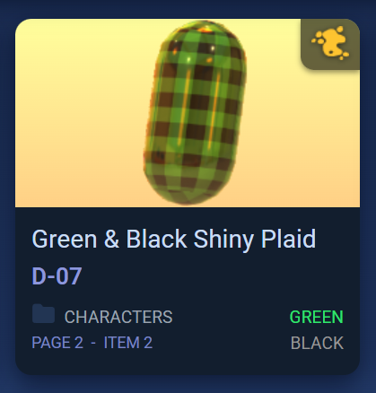

 
In the bottom right of each card is up to three colors that are featured in the cosmetic item.

There may be additional colors, but these are the most predominant colors.

Note that to keep the total number of colors to a minimum, and to make it easier to catagorise and find items, I chose these 15 colors to describe all cosmetics.

- Black
- Blue
- Bronze
- Brown
- Gold
- Green
- Grey
- Orange
- Pink
- Purple
- Rainbow
- Red
- Silver
- White
- Yellow

## Seasonal Video Links
Seasonal videos will only be available in either October or December for the Pumpkin and Snowflake collectables.
They should automatically be seen when hovering over the thumbnail when they are actually collectable to help prevent clutter and confusion for the rest of the year.

**Note, I have not currently created these videos.**

I only started this project in January and missed the chance to record these collectables with my 2nd Steam account (I had already completed them all in my main account), but I will endeavor to collect them all and update this website in October and December 2026 as soon as I can record, edit and publish the videos.

I will post in the Zeepkist discord when they have been added.
